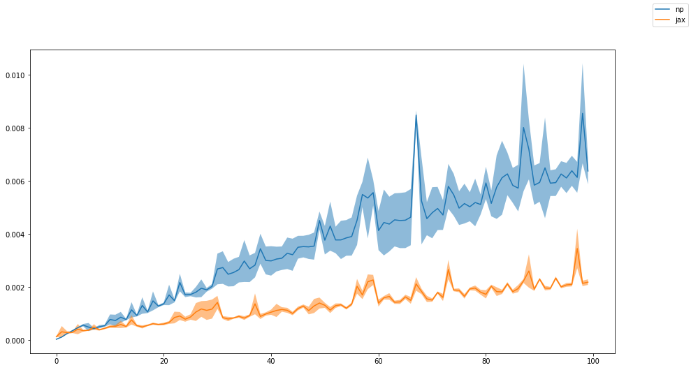

# Fenton-Karma model (three currents)


This repo provides a python implementation of the FK model described in [Multiple mechanisms of spiral wave breakup in a model of cardiac electrical activity](https://aip.scitation.org/doi/10.1063/1.1504242), using [JAX](https://github.com/google/jax)


## Performance analysis

We test performance and scalability against two quantities, tissue size and number of iterations.
Tests are performed using the notebooks in the repository, google cola.
Time is measured using the `timeit` module over 10 runs. Result is the average.

<br>

### Testing field size
The number of iterations is set to `1e3`.
|  framework/field size 	|  (64, 64) 	|  (128, 128) 	| (256, 256) 	| (512, 512) 	| (1024, 1024) 	|
|-----------------------	|-----------	|-------------	|------------	|------------	|--------------	|
| numpy                 	| 695 ms    	| 1.85 s     	| 9.56 s    	| 39.5 s    	| 2 min 28 s   	|
| JAX (CPU)             	| 336 ms    	| 904 ms      	| 2.94 s     	| 11.1 s     	| 45 s         	|
| JAX (GPU)             	| 193 ms    	| 189 ms      	| 199 ms     	| 237 ms     	| 613 ms       	|
| JAX (TPU)             	| 59 ms     	| 74 ms      	| 119 ms     	| 272 ms      	| 842 ms       	|

<br>

### Testing the number of iterations
The field size is set to `(128, 128)`. (E) stands for expected times based on linear extrapolation.
|  framework/iterations 	| 1e2       	| 1e3         	| 1e4        	| 1e5        	| 1e6          	|
|-----------------------	|-----------	|-------------	|------------	|------------	|--------------	|
| numpy                 	| 180 ms        | 1.84 s      	| 18.5 s     	| 186 s     	| (E) 1840 s  	|
| JAX (CPU)             	| 93 ms    	    | 916 ms      	| 8.9 s     	| 88 s      	| (E) 900 s    	|
| JAX (GPU)             	| 26 ms     	| 243 ms      	| 2.37 s     	| 24 s     	    | 180 s      	|
| JAX (TPU)             	| 14 ms       	| 74 ms      	| 669 ms     	| 6.63 s     	| 66 s       	|

<br>

### Testing the compilation of `for` loops
Contributions of the vectorization of the stepping scheme `jax.lax.fori_loop` on `1e3` iterations and field size `(128, 128)`. Note that this test does not include results plotting.
|  framework/vectorization 	| compiled-for  	| uncompiled-for   	| 
|-----------------------	|----------------	|------------------	|
| numpy                 	| \             	| \                	|
| JAX (CPU)             	| 895 s    	        | 1.87 ms           | 
| JAX (GPU)             	| 186 ms        	| 2.29 s           	|
| JAX (TPU)             	| 74 ms           	| 6.46 s            |

<br>

### Low level comparison on `np.gradients`
On the x axis, the dimension for each of the two axes. On the y, the execution time in seconds.
JAX results are CPU-based.


<br>

### Settings
All tests have been performed using googla golab.
The hardware used is as follows:


1. `lscpu` returned:
    
```
Architecture:        x86_64
CPU op-mode(s):      32-bit, 64-bit
Byte Order:          Little Endian
CPU(s):              2
On-line CPU(s) list: 0,1
Thread(s) per core:  2
Core(s) per socket:  1
Socket(s):           1
NUMA node(s):        1
Vendor ID:           GenuineIntel
CPU family:          6
Model:               79
Model name:          Intel(R) Xeon(R) CPU @ 2.20GHz
Stepping:            0
CPU MHz:             2200.000
BogoMIPS:            4400.00
Hypervisor vendor:   KVM
Virtualization type: full
L1d cache:           32K
L1i cache:           32K
L2 cache:            256K
L3 cache:            56320K
NUMA node0 CPU(s):   0,1
Flags:               fpu vme de pse tsc msr pae mce cx8 apic sep mtrr pge mca cmov pat pse36 clflush mmx fxsr sse sse2 ss ht syscall nx pdpe1gb rdtscp lm constant_tsc rep_good nopl xtopology nonstop_tsc cpuid tsc_known_freq pni pclmulqdq ssse3 fma cx16 pcid sse4_1 sse4_2 x2apic movbe popcnt aes xsave avx f16c rdrand hypervisor lahf_lm abm 3dnowprefetch invpcid_single ssbd ibrs ibpb stibp fsgsbase tsc_adjust bmi1 hle avx2 smep bmi2 erms invpcid rtm rdseed adx smap xsaveopt arat md_clear arch_capabilities
```

2. `nvidia-smi` returned:

```
Wed Mar 25 13:58:37 2020       
+-----------------------------------------------------------------------------+
| NVIDIA-SMI 440.64.00    Driver Version: 418.67       CUDA Version: 10.1     |
|-------------------------------+----------------------+----------------------+
| GPU  Name        Persistence-M| Bus-Id        Disp.A | Volatile Uncorr. ECC |
| Fan  Temp  Perf  Pwr:Usage/Cap|         Memory-Usage | GPU-Util  Compute M. |
|===============================+======================+======================|
|   0  Tesla T4            Off  | 00000000:00:04.0 Off |                    0 |
| N/A   60C    P8    10W /  70W |      0MiB / 15079MiB |      0%      Default |
+-------------------------------+----------------------+----------------------+
                                                                               
+-----------------------------------------------------------------------------+
| Processes:                                                       GPU Memory |
|  GPU       PID   Type   Process name                             Usage      |
|=============================================================================|
|  No running processes found                                                 |
+-----------------------------------------------------------------------------+
```
